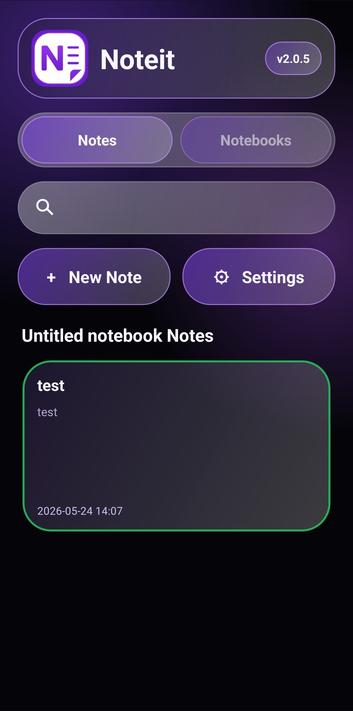
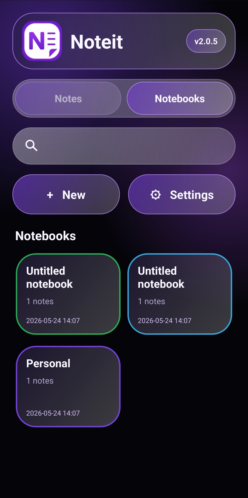
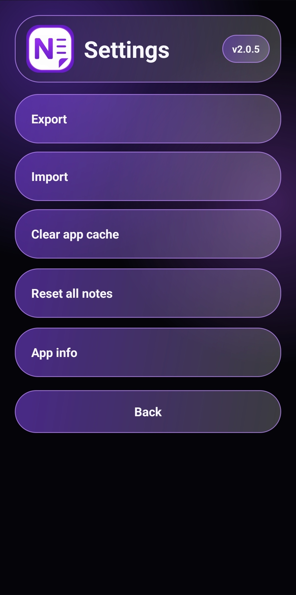

# Noteit 

Noteit is a lightweight local notes app for Android 10 and newer.

## Previews





## Start

Download the prevuild APK from Github Releases page.

Install the generated APK on an Android 10+ device.

## Features

- Modern deep dark glassmorphism interface
- Purple glow accent inspired by modern note apps
- Two-column notes grid on the home screen
- Search bar above actions
- Local JSON note storage
- Markdown-oriented editor helpers
- Link and image reference insertion
- Single-note Markdown export
- Full ZIP export with JSON, Markdown, TXT and CSV
- Import from Noteit ZIP, JSON, Markdown or TXT
- Settings screen with local maintenance actions

All user-facing text is written in English. No external services are required.

## Build your own

- Open this folder in Android Studio.
- Sync Gradle.
- Build a debug or release APK.

## Build configuration

- Application ID: `com.sksdesign.noteit`
- Minimum SDK: 29
- Compile SDK: 35
- Target SDK: 35
- Gradle wrapper: 9.4.1
- Version name: 2.0.5
- Version code: 204

## Note

This is a personal hobby project and is provided completely "as is". 
No warranties or guarantees of any kind are provided regarding its functionality, reliability, or safety. 
Please read the full documentation to understand how it works and what to expect before using it.
Use it entirely at your own risk. 

## License Information

See License MD:

```text
LICENSE.md
```

## Repository
https://github.com/complicatiion/NOTEit_app


## Version 2.0.5

### complicatiion aka sksdesign 24.05.2026

